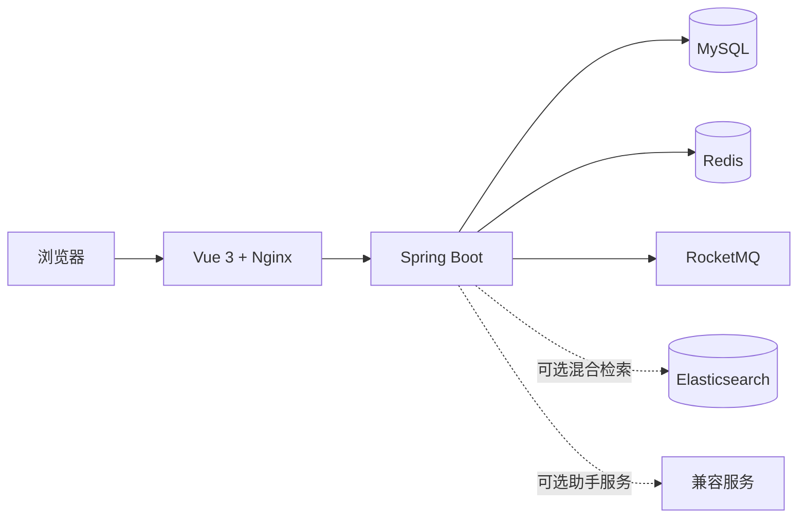

# CampusCircle

CampusCircle 是一个面向高校学生的地理位置校园社区。用户绑定具体校区后，可按同校区、同校、10 km、20 km 或同市范围浏览内容；系统同时提供内容互动、通知、热门榜、后台治理，以及带权限范围约束的校园问答能力。

## 核心能力

- 用户注册、首次昵称确认、登录、头像本地上传、资料设置、公开个人主页与互动记录，以及短期 Access Token 与 HttpOnly Refresh Token 会话续期
- 帖子、评论、点赞、通知、分类和后台管理
- 高校-校区模型：高校统一归档，校区拥有独立经纬度；发现范围支持同校区、同校、10 km、20 km 与同市
- 发现层与互动层分离：附近 Feed、热门榜和校园助手按学校范围检索；通知、详情、评论、点赞与个人主页可直接访问已知内容
- Redis 热榜、附近学校缓存、浏览量批量刷库与 Redis 故障降级
- 评论/点赞事件与站内通知；RocketMQ 模式采用 Transactional Outbox，支持至少一次投递与消费者幂等
- AI 问答：Token 身份认证、附近学校权限过滤、Elasticsearch 关键词与向量检索、RRF 融合、SQL 降级、Prompt 组装、模型调用、引用校验与用户级限流
- 问题订阅闭环：发起者、订阅者与回答者角色分离；每篇帖子或每条一级评论均可发起一个问题，评论问题会聚合展示在所属帖子中；回答者通过真实评论提交候选答复，发起者可通过多条有效答复后结束或重新开启问题，并通过 Outbox/RocketMQ 通知订阅者
- Vue 3 前端：登录注册、附近 Feed、筛选、帖子详情、个人主页、互动记录、错误反馈与移动端导航
- 产品闭环：首次登录学校绑定、发帖、帖子详情互动、公开主页、资料设置、站内通知与校园助手

## 问题订阅与候选答复

CampusCircle 将“等待结论”的帖子或评论建模为可订阅的问题，而不是普通的帖子收藏。内容作者发起问题，其他用户独立订阅；回答者通过真实评论提交候选答复，发起者可通过多条有效答复，并在确认信息已足够后主动结束问题。若后续仍需补充信息，发起者可重新开启问题，保留已有通过答复和订阅记录并继续收集候选答复。已完成问题仍允许新用户订阅并直接查看全部已通过答复；删除问题会通知订阅者并清理失效订阅。

当前实现包含订阅的进行中/已完成分栏、评论问题的帖子内聚合、候选答复预览与完整列表、通过/标记无效、独立结束/重新开启问题、删除保护，以及基于 Transactional Outbox 和 RocketMQ 的生命周期通知。帖子作者在本帖评论或回复时会显示“作者”标签。详细产品规则见 [问题追踪设计与开发路线](docs/question-tracking-design.md)，接口见 [API 文档](docs/API.md)。

## 技术栈

| 层次 | 技术 |
| --- | --- |
| 后端 | Java 17、Spring Boot 4、Spring Validation、MyBatis-Plus、MySQL |
| 缓存与消息 | Redis、RocketMQ、Transactional Outbox |
| AI 与检索 | OpenAI-compatible API、Qwen、RAG、Elasticsearch、Embedding、kNN、RRF 混合检索 |
| 前端 | Vue 3、TypeScript、Vue Router、Axios、Vite、Lucide |
| 交付与测试 | Docker、Docker Compose、Nginx、JUnit、Spring Boot Test、H2 |

## 架构概览



## 项目结构

```text
src/main/java/com/campuscircle
├── ai          AI 问答、检索、Prompt 与模型客户端
├── auth        会话、认证与当前用户识别
├── event       领域事件、Outbox、RocketMQ 投递与消费
├── post        帖子、Feed、热榜与浏览量
├── school      高校/校区选择、范围计算与缓存
├── comment / like / notice / admin / user
└── common / exception

frontend/
├── src/api     Axios 客户端与接口模块
├── src/auth    会话状态
├── src/pages   登录、注册、Feed 页面
└── src/components
```

## 设计文档

- [后续开发路线图](docs/development-roadmap.md)
- [问题追踪设计与开发路线](docs/question-tracking-design.md)
- [RAG v1 混合检索设计](docs/rag-v1-hybrid-retrieval.md)
- [产品闭环审查记录](docs/product-closure-audit.md)
- [首轮发布范围](docs/release-scope.md)
- [首次部署与回滚手册](docs/deployment-runbook.md)
- [演示与项目讲解指南](docs/demo-guide.md)
- [高校-校区迁移脚本](docs/db-migrations/003_university_campus_scope.sql)

## 本地启动

1. 创建本地配置。

```powershell
Copy-Item .env.example .env
```

2. 启动 MySQL 和 Redis。

```powershell
docker compose up -d mysql redis
```

3. 启动后端。

```powershell
.\mvnw.cmd spring-boot:run "-Dspring-boot.run.profiles=redis"
```

4. 启动 Vue 前端。

```powershell
Set-Location frontend
npm.cmd install
npm.cmd run dev
```

前端默认访问 `http://localhost:5173`，开发服务器会将 `/api` 代理到后端 `http://localhost:8080`。

登录成功后，后端会把 Refresh Token 写入仅限 `/api/auth` 使用的 HttpOnly Cookie；浏览器端只保存短期 Access Token。Access Token 失效时，Axios 会合并并发的刷新请求、轮换 Refresh Token，并重放原请求；刷新失败才清除本地登录态。生产环境启用 HTTPS 时，请在 `.env` 中设置：

```dotenv
CAMPUSCIRCLE_AUTH_REFRESH_COOKIE_SECURE=true
```

## 完整容器化启动

```powershell
docker compose --profile app --profile search up -d --build
```

- Web：`http://localhost:8088`，可通过 `CAMPUSCIRCLE_WEB_PORT` 修改
- 后端：`http://localhost:8080`
- MySQL：`localhost:3307`
- Redis：`localhost:6379`

启动完成后可执行健康与入口检查：

```powershell
powershell -ExecutionPolicy Bypass -File .\scripts\smoke-test.ps1
```

生产部署必须使用 [生产配置示例](deploy/production.env.example) 和 [首次部署与回滚手册](docs/deployment-runbook.md)，并确认 HTTPS 下的 `CAMPUSCIRCLE_AUTH_REFRESH_COOKIE_SECURE=true`。

停止服务：

```powershell
docker compose --profile app down
```

## 可选能力

### 问题追踪

项目以“问题订阅 + 候选答复 + 发起者确认”为唯一的结果追踪链路：发起者可以结束、重新开启或删除问题；订阅者可以在进行中和已完成状态下订阅或取消订阅；多个有效答复可以并存。

### AI 模型

默认使用 `mock`，不会发起外部请求。接入 OpenAI 兼容模型时，在 `.env` 中填写：

```dotenv
CAMPUSCIRCLE_AI_PROVIDER=openai-compatible
CAMPUSCIRCLE_AI_BASE_URL=https://example.com/compatible-mode/v1
CAMPUSCIRCLE_AI_API_KEY=your-local-api-key
CAMPUSCIRCLE_AI_MODEL=your-model-name
CAMPUSCIRCLE_AI_ENABLE_THINKING=false
```

真实 API Key 只保存在 `.env` 或部署环境变量中，绝不提交到仓库。

### 认证会话

Docker 与生产环境启用 `redis` profile 后，Refresh Token 会通过 Redis 保存为可撤销的会话状态，并以 HttpOnly、SameSite=Lax Cookie 交付给浏览器。每次调用刷新接口都会轮换 Refresh Token，旧 Token 立即失效；退出登录会同时撤销当前 Access Token 和 Refresh Token。未启用 `redis` profile 时，项目使用仅适合本地调试的进程内会话实现。本地 HTTP 环境保持 `CAMPUSCIRCLE_AUTH_REFRESH_COOKIE_SECURE=false`，部署到 HTTPS 后必须改为 `true`。

### RocketMQ 与 Outbox

启用 `rocketmq` profile 后，评论和点赞会在同一数据库事务中写入 `event_outbox`；后台调度器成功投递后再标记事件完成，投递失败会指数退避重试。消费者按 `eventId` 写入通知幂等键，允许消息重复而不会产生重复通知。

新建数据库会自动创建 Outbox 表。已有本地 MySQL 数据库需要执行一次 `src/main/resources/db/schema.sql` 中的 `event_outbox` 建表语句后再启用该 profile。

### 已有数据库升级

新建数据库会直接使用完整的高校-校区表结构。已有本地数据库需要按顺序执行一次以下脚本，将原有学校记录迁移为“高校 + 校区”数据，同时保留既有 `school_id` 关联：

```powershell
docker compose cp docs/db-migrations/003_university_campus_scope.sql mysql:/tmp/003_university_campus_scope.sql
docker compose exec -T mysql sh -lc "mysql -uroot -pcampuscircle_dev_pwd campuscircle < /tmp/003_university_campus_scope.sql"
```

执行后可重新导入 `src/main/resources/db/data.sql`，获得内置的多校区示例数据。

若本地数据库已经运行过旧版本，还需要执行一次首次昵称确认迁移。已有账号会自动标记为已确认昵称；只有迁移后新注册的账号才会在首次登录时进入昵称确认页：

```powershell
docker compose cp docs/db-migrations/004_nickname_onboarding.sql mysql:/tmp/004_nickname_onboarding.sql
docker compose exec -T mysql sh -lc "mysql -uroot -pcampuscircle_dev_pwd campuscircle < /tmp/004_nickname_onboarding.sql"
```

### Elasticsearch

```powershell
docker compose --profile search up -d elasticsearch
```

Elasticsearch 已接入异步索引、关键词检索、向量检索与 RRF 融合排序。MySQL 始终是事实源：ES 仅保存检索投影，最终候选帖子会按排序回查 MySQL；当 ES 或 Embedding 服务不可用时，系统自动降级到 SQL 关键词检索。

启用混合检索前，需要先启动 Elasticsearch，并在本地 `.env` 中设置 `CAMPUSCIRCLE_SEARCH_ENABLED=true`。本地链路验证可使用 `CAMPUSCIRCLE_SEARCH_EMBEDDING_PROVIDER=mock`；真实语义检索需要配置 OpenAI-compatible Embedding 服务。首次开启时，管理员可调用 `POST /api/admin/search/posts/reindex` 重建已有帖子索引。详细配置、重建和评测步骤见 [RAG v1 混合检索设计](docs/rag-v1-hybrid-retrieval.md)。

## 测试

```powershell
.\mvnw.cmd test

Set-Location frontend
npm.cmd run lint
npm.cmd run build
```

接口详情见 [docs/API.md](docs/API.md)，前端请求约定见 [docs/frontend-api-contract.md](docs/frontend-api-contract.md)。完整产品链路、权限边界和验收范围见 [docs/product-closure-audit.md](docs/product-closure-audit.md)。

旧版本本地数据库请按“已有数据库升级”章节顺序执行对应迁移；新建数据库不需要额外操作。
