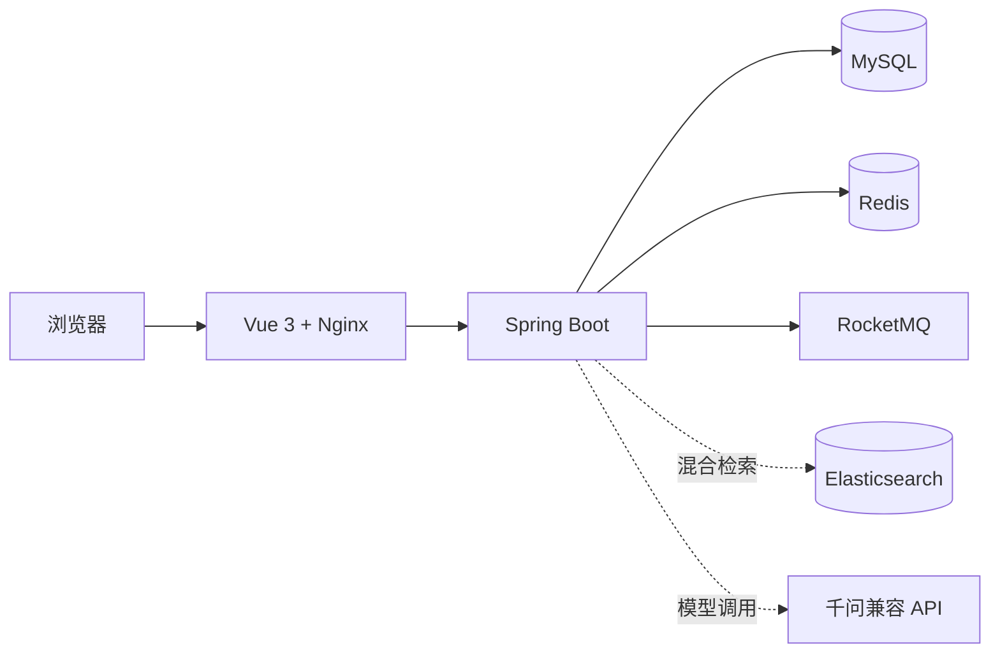

# UniNook

按校区地理位置组织的高校社区。你绑定了哪所学校的哪个校区，看到的就是那个圈子的内容。

👉 **[joinuninook.com](https://joinuninook.com)**

## 为什么不是又一个论坛？

一个校园帖子对隔壁学校的人来说可能是噪音。UniNook 的核心规则很简单：**内容有"可见范围"**。

- 📍 发帖和浏览可以限定在同校区、同校、10 公里、20 公里或同市
- 🔔 通知、详情页、个人主页**不受范围切换影响**——你关注的人发了什么，直接通知你
- ❓ 对某条讨论有疑问？发起一个"问题"——其他用户订阅，回答者通过真实评论提交候选答复，直到发起者确认采纳。不是"收藏一下等更新"，是一条有始有终的追踪链路
- 🤖 内置 AI 校园助手：你的问题只在你可见范围内的帖子里检索，ES 关键词 + 向量检索 + 千问模型生成回答。ES 或 Embedding 挂了自动降级到 SQL 关键词——助手不会 500

## 创新点

### RAG 混合检索（面向真实故障）

不是调个 API 套壳。关键词检索（ES BM25）和向量检索（kNN）各自跑、RRF 融合排序、候选集回查 MySQL 拿最新状态，然后组装 Prompt 交给千问。ES 不可用 → SQL LIKE 降级；Embedding 不可用 → 纯关键词。每条答案都附带引用帖子，可追溯。

### Transactional Outbox 消息投递

评论、点赞、问题状态变更——和业务数据**同一事务**写入 `event_outbox` 表，调度器异步投递 RocketMQ，消费者按 `eventId` 幂等写通知。不会出现"事务没提交但消息已经发出去了"的问题，也不会"来两条重复消息产生两条重复通知"。

### 问题追踪 ≠ 帖子收藏

一篇帖子或一级评论只能发起一个问题。发起者、订阅者、回答者角色分离；候选答复是真实评论、发起者通过/拒绝/结束/重开，完整生命周期事件通过 Outbox 通知。不是"收藏等结论"——是"追问直到有结论"。

### Redis 多处使用，每处都有降级

| 用途 | 降级策略 |
|---|---|
| 热榜缓存 | TTL + 抖动防雪崩 + 重建互斥锁 |
| 附近学校缓存 | 数据几乎不变，TTL |
| 浏览量缓冲 | 内存聚合 + 定时批量刷库，Redis 挂了进程内继续计数 |
| Token 会话 | Redis 不可用降级为进程内实现 |
| 限流 | Redis 不可用降级为进程内计数 |

## 功能全景

> 详情见 [开发路线图](docs/development-roadmap.md) —— 已完成与计划中有明确区分。

### ✅ 已完成

**社区基础：** 注册/登录、昵称确认、头像上传、个人主页、资料设置、学校绑定与切换（含次数限制）

**内容互动：** 发帖（按分类）、评论（含二级回复）、点赞（帖子+评论）、站内通知（评论/点赞/问题状态）

**推荐与发现：** Feed 按校区/同校/10km/20km/同市五种范围筛选、热门榜（Redis 缓存）、校园附近学校定位

**问题追踪：** 发起问题、订阅、候选答复提交、发起者通过/拒绝、结束/重开、删除保护、订阅者通知；评论中的问题在帖子详情内聚合展示；帖子作者显示"作者"标签

**AI 校园助手：** ES BM25 + kNN 向量 + RRF 融合 → 千问生成；校区权限过滤；检索降级；用户级限流；回答附带引用

**工程与部署：** Docker Compose 单机部署、Nginx HTTPS 终止、GitHub Actions CI（测试 + lint + 构建校验）、健康检查、备份与回滚

### 📋 计划中

已整理在 [开发路线图](docs/development-roadmap.md)：

- 检索评测与可观测性（真实 Embedding 模型、评测集、指标）
- 问答体验提升（流式输出、引用卡片、候选答复 AI 辅助筛选）
- 产品完整性（通知分类、设置页、订阅中心）
- 最小管理台（独立管理员入口，后端接口已就绪）
- 前端体验打磨（评论定位平滑滚动、自有 UI 设计语言）

## 架构



[查看高清架构图](https://github.com/tyj-618/UniNook/blob/main/docs/architecture.png)

## 技术栈

| 层次 | 技术 |
| --- | --- |
| 后端 | Java 17、Spring Boot 4、MyBatis-Plus |
| 缓存 | Redis（会话、热榜、附近学校缓存、限流） |
| 消息 | RocketMQ + Transactional Outbox |
| AI / 检索 | Elasticsearch（BM25 + kNN）、RRF、Embedding、千问 Qwen |
| 前端 | Vue 3、TypeScript、Vite、Axios、Lucide 图标 |
| 测试 | JUnit、Spring Boot Test、H2 |
| 部署 | Docker Compose、Nginx、GitHub Actions |

## 项目结构

```
src/main/java/com/uninook
├── ai          AI 问答、检索、Prompt 与模型客户端
├── auth        会话、认证与当前用户识别
├── event       领域事件、Outbox、RocketMQ 投递与消费
├── post        帖子、Feed、热榜与浏览量
├── school      高校/校区选择、范围计算与缓存
├── question    问题追踪、候选答复
├── comment     评论、点赞、回复
├── like        帖子点赞
├── notice      站内通知
├── admin       管理员操作（帖子隐藏/恢复、用户禁用/启用、索引重建）
├── user        用户资料、头像、主页
├── category    帖子分类
├── common      通用响应、实体、异常
└── exception   全局异常处理

frontend/
├── src/api      Axios 客户端与接口模块
├── src/auth     会话状态（登录、刷新、自动恢复）
├── src/pages    页面组件（Feed、帖子详情、通知、问题追踪……）
└── src/components 公共组件
```

## 本地跑起来

需要本地安装 Docker 和 Node.js 22。

```powershell
cp .env.example .env
docker compose up -d mysql redis
.\mvnw.cmd spring-boot:run "-Dspring-boot.run.profiles=redis"
```

```powershell
cd frontend
npm install
npm run dev
```

前端 `http://localhost:5173`，开发服务器自动把 `/api` 代理到 `localhost:8080`。

**容器化完整启动（含 Elasticsearch）：**

```powershell
docker compose --profile app --profile search up -d --build
```

访问 `http://localhost:8088`。首次启动后可用 smoke test 验证：

```powershell
powershell -ExecutionPolicy Bypass -File .\scripts\smoke-test.ps1
```

**测试：**

```powershell
.\mvnw.cmd test
cd frontend && npm run lint && npm run build
```

## 文档索引

| 文档 | 用途 |
|---|---|
| [开发路线图](docs/development-roadmap.md) | 已完成功能、各阶段待办、验收原则 |
| [部署与回滚手册](docs/deployment-runbook.md) | 云服务器部署、备份、回滚步骤 |
| [API 文档](docs/API.md) | 接口说明 |
| [前端 API 契约](docs/frontend-api-contract.md) | 前端与后端约定 |
| [问题追踪设计](docs/question-tracking-design.md) | 问题订阅、候选答复、生命周期 |
| [RAG v1 混合检索设计](docs/rag-v1-hybrid-retrieval.md) | 索引、检索、融合、降级 |
| [演示与讲解指南](docs/demo-guide.md) | 五分钟演示路径 + 面试工程点 |
| [产品闭环审查](docs/product-closure-audit.md) | 功能边界与验收 |
| [数据库迁移脚本](docs/db-migrations/) | 按编号顺序执行，新建数据库无需额外操作 |

## 许可

MIT
