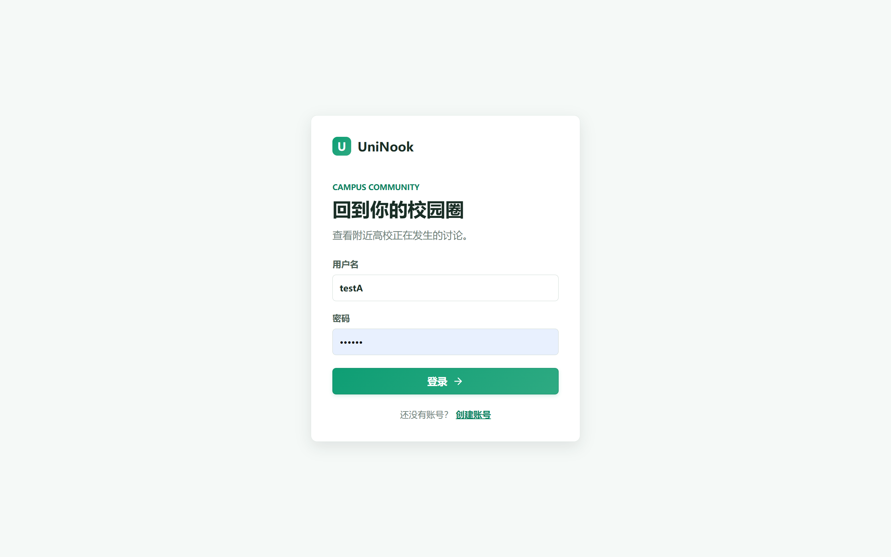
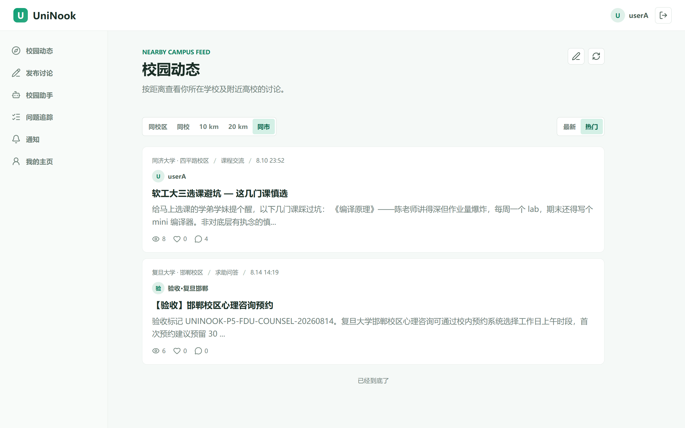
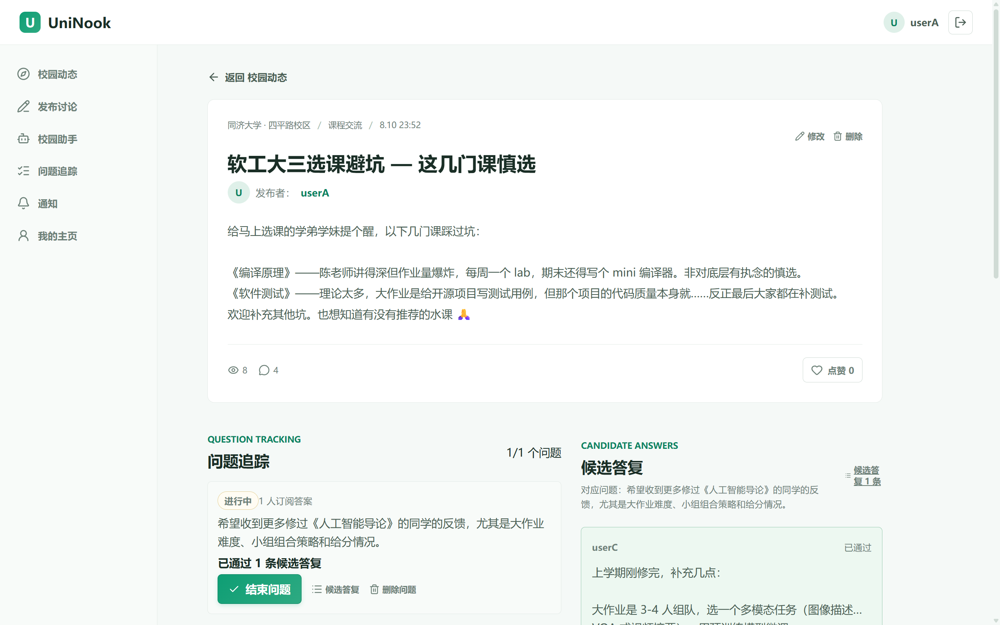
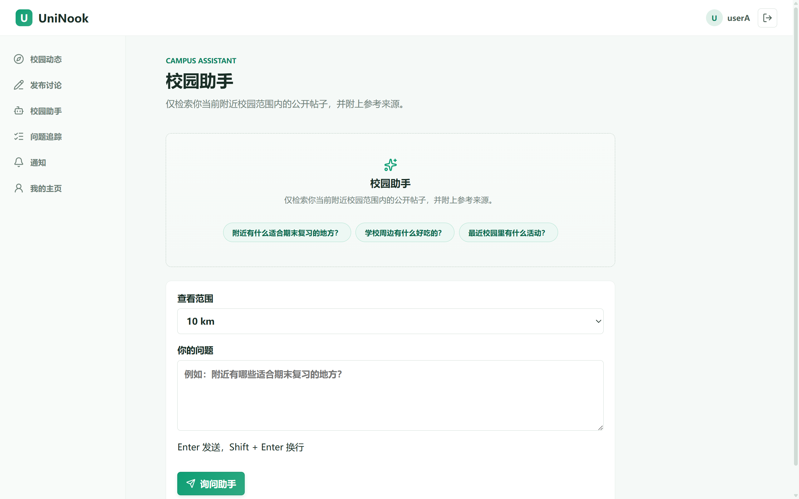
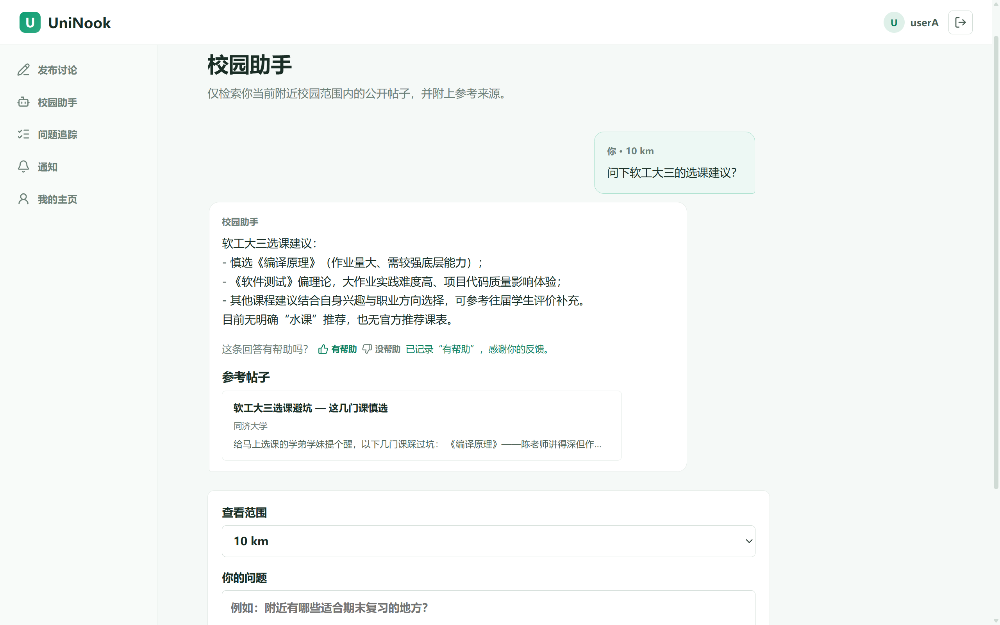
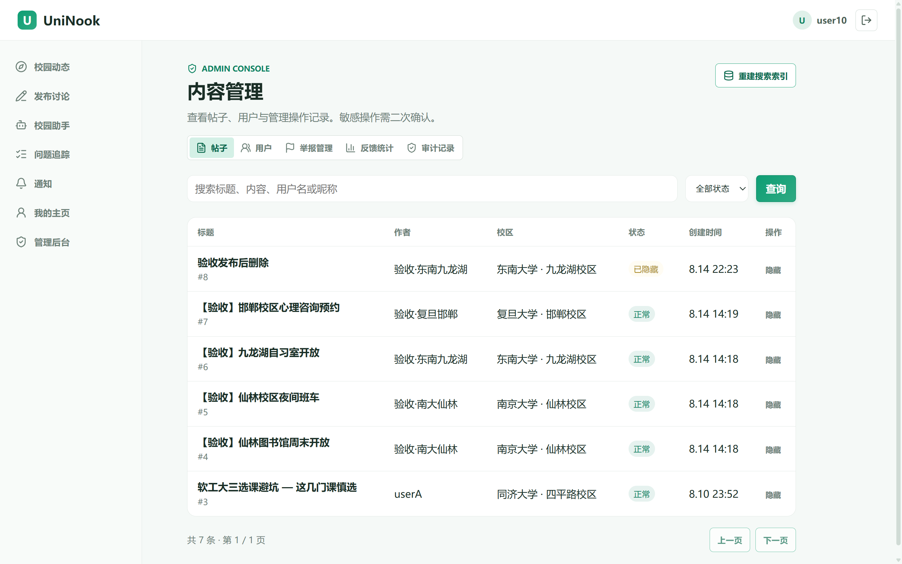

# UniNook — 地理位置校园社区

[]()
[]()
[]()
[]()

> 面向大学生的地理位置校园社区，集成 AI 校园助手（RAG + Agent 编排）。

## 在线演示

 [joinuninook.com](https://joinuninook.com)

## 功能概览

### 社区功能
- **校园动态**：按距离查看附近高校讨论（同校区/同校/10km/20km/同市）
- **帖子详情**：富文本内容、点赞、评论、追评、举报
- **问题追踪**：帖子/评论中发起问题，AI 生成候选答复，人工审核采纳
- **通知系统**：评论回复、问题状态变更实时推送

### AI 校园助手
- **多轮对话**：Redis 会话管理，滑动窗口上下文
- **SSE 流式输出**：逐字显示，带闪烁光标
- **Agent 编排**：ReAct 循环 + 工具调用（检索帖子）
- **确认发帖**：AI 生成草稿 → 用户确认 → 发布到社区
- **反馈机制**：👎 评价回答质量

### 管理后台
- **内容管理**：帖子隐藏/恢复、用户禁用/启用
- **举报处理**：举报审核、处理意见记录
- **反馈统计**：低质量回答分析、高频问题统计
- **审计日志**：管理员操作全记录

## 技术栈

### 后端
- Spring Boot 4.0.6 + Java 17
- MyBatis-Plus 3.5.15
- MySQL 8.4 + Redis 7.4
- Elasticsearch 8.19（BM25 + kNN 混合检索）
- RocketMQ 2.3.5（Transactional Outbox）

### 前端
- Vue 3 + TypeScript + Vite
- 原生 CSS（Design Token 体系）
- Axios + SSE（ReadableStream）

### AI 集成
- OpenAI 兼容 API（千问/DeepSeek）
- RAG 混合检索（ES BM25 + kNN + RRF）
- Agent 编排（ReAct + Tool Calling）

## 项目截图

### 登录页


### 校园动态


### 帖子详情


### 助手 - 空状态引导


### 助手 - 对话中


### 管理后台


## 架构设计

### 核心链路

```
用户提问 → SSE 流式响应 → Agent 编排循环 → 工具调用（检索帖子）→ RAG 混合检索 → LLM 生成 → 流式返回
```

### 关键设计决策
1. **安全**：user_id/campus_id 从登录态注入，不信任 LLM 返回值
2. **工具白名单**：只注册安全工具，不在注册表的调用一律拒绝
3. **破坏性操作确认**：发帖等写操作返回"待确认"，前端确认后才执行
4. **选择性降级**：ES 挂退化为纯 kNN，反向则纯 BM25，全挂才 SQL 兜底
5. **可观测性**：requestId 全链路贯穿，分段埋点

## 快速开始

### 本地开发

```bash
# 1. 克隆仓库
git clone https://github.com/tyj-618/UniNook.git
cd UniNook

# 2. 启动基础设施（MySQL/Redis/ES）
docker compose up -d mysql redis elasticsearch

# 3. 启动后端
./mvnw spring-boot:run

# 4. 启动前端
cd frontend
npm install
npm run dev
```

### 生产部署

```bash
# 1. 克隆仓库
git clone https://github.com/tyj-618/UniNook.git
cd UniNook

# 2. 一键部署
docker compose up -d --build

# 3. 访问
# 前端：http://localhost:8088
# 后端：http://localhost:8080
```

## 项目结构

```
UniNook/
├── src/main/java/com/uninook/
│   ├── ai/              # AI 助手（Agent 编排/RAG/工具调用）
│   ├── admin/           # 管理后台
│   ├── post/            # 帖子/评论
│   ├── question/        # 问题追踪
│   ├── report/          # 举报
│   ├── user/            # 用户/认证
│   └── notification/    # 通知
├── frontend/            # Vue 3 前端
├── scripts/             # 运维脚本（备份/健康检查）
└── docs/                # 文档（设计语言/部署手册）
```

## 测试

```bash
# 运行全量测试
./mvnw test

# 生成覆盖率报告
./mvnw test jacoco:report
```

核心链路覆盖率 > 80%（助手问答/确认发帖/举报/审计日志）。

## 文档

- [设计语言规范](docs/uninook-design-language.md)
- [部署手册](docs/deployment-runbook.md)
- [备份恢复](docs/backup-runbook.md)
- [密钥轮换](docs/secrets-rotation.md)

## License

MIT
